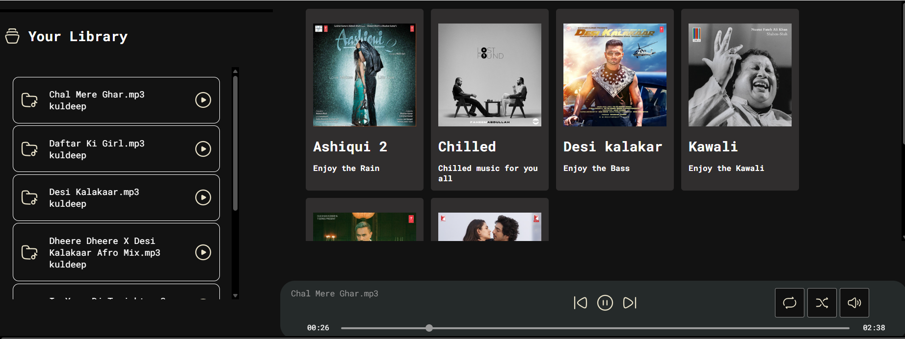

# 🎵 Spotify Clone

A simple **Spotify-like music streaming UI** built using **HTML, CSS, and JavaScript**.  
This project focuses on UI, audio controls, and playlist handling.

---

## 🚀 Live Demo
🔗 https://parmarkuldeep117.github.io/SpotifyClone/

---

## 🛠 Tech Stack
- HTML5
- CSS3
- JavaScript (ES6)

---

## ✨ Features
- ▶️ Play / Pause music
- ⏭ Next / Previous track
- 🔁 Repeat mode
- 🔀 Shuffle mode
- 📃 Playlist support
- 🎧 Audio progress control

---

## 📸 Screenshots

### 🏠 Home

### 🎶 Playlist

### ▶️ Player

---

## 🧑‍💻 Author
**Kuldeep Parmar**  
GitHub: https://github.com/Parmarkuldeep117

---

⭐ If you like this project, give it a star!
